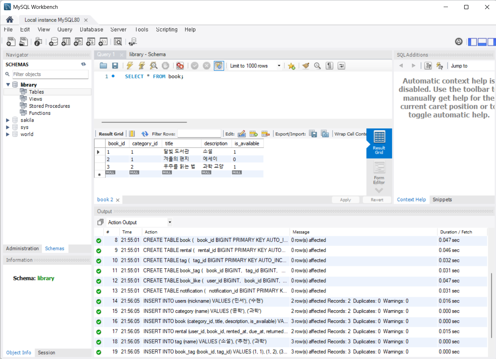
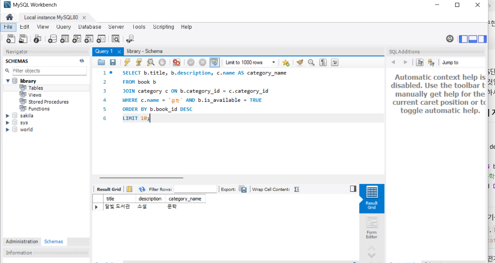
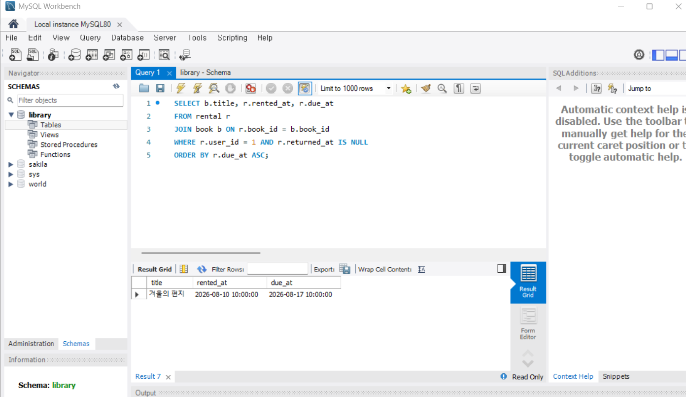
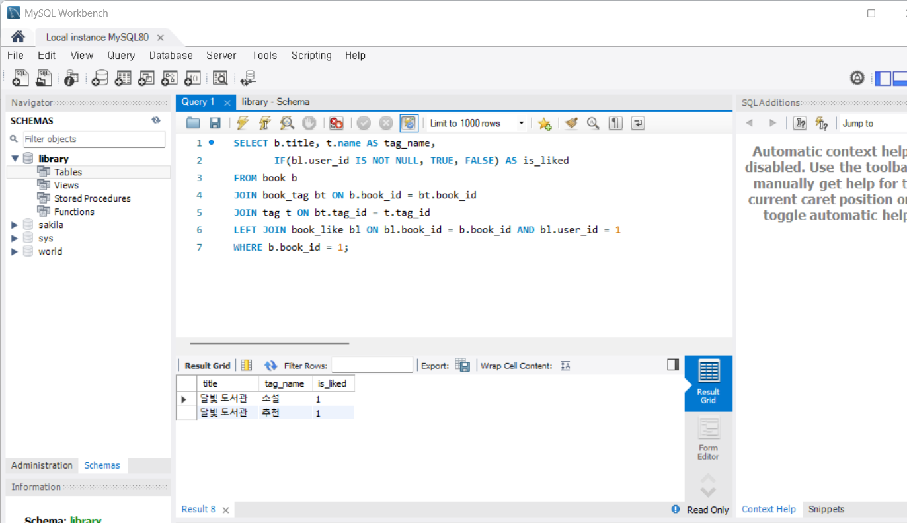
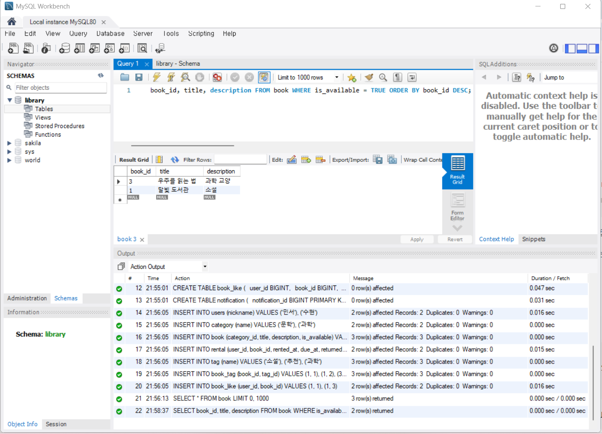
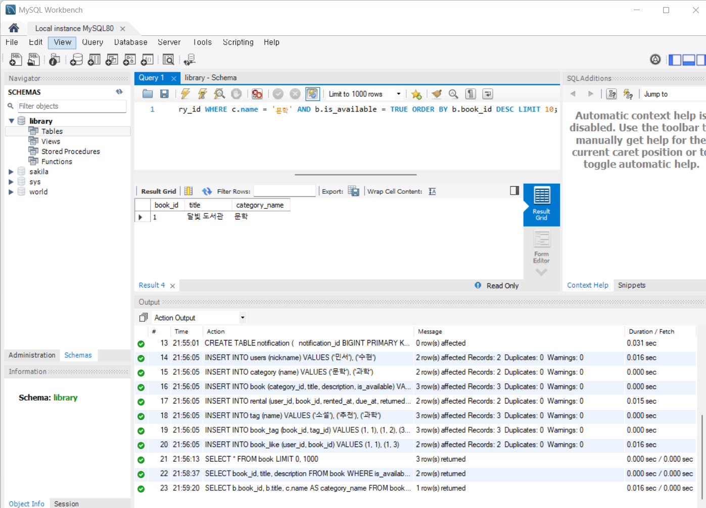
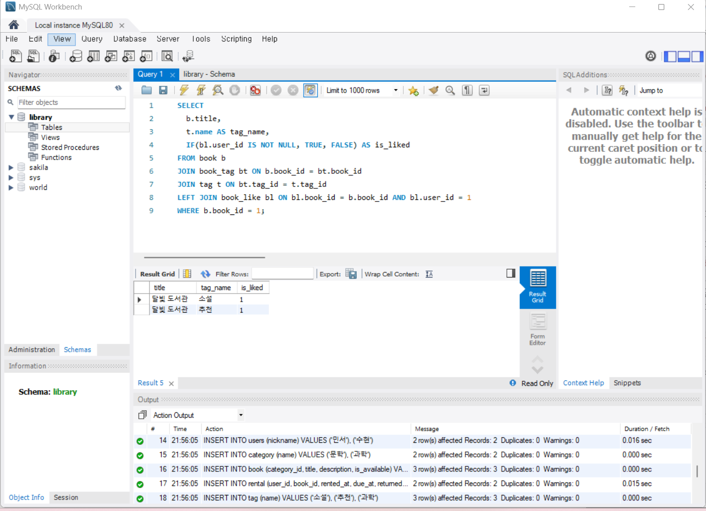

## Week2 Misson02_back

기준 테이블은 book이고 category를 JOIN한 이유는 카테고리 이름이 book이 아니라 category 테이블에 있어서, book.category_id와 category.category_id를 연결해야 이름을 가져올 수 있기 때문입니다. WHERE 조건으로 카테고리명이 '문학'인지, 대여 가능\상태인지를 걸렀고, book_id 내림차순으로 정렬해 최신 10건만 가져오도록 LIMIT 10을 적용했습니다.

기준 테이블은 rental이고 book을 JOIN한 이유는 rental에 책 제목이 없고 book_id로만 연결되어 있어, book.book_id와 매칭해 제목을 가져와야 하기 때문입니다. WHERE 조건은 특정 사용자의 기록만 보되, 아직 반납하지 않은 것만 걸러야 하므로 returned_at IS NULL을 사용했습니다. 목록은 반납 예정일이 가까운 순으로 봐야 하므로 due_at 오름차순으로 정렬했습니다.

기준 테이블은 book이고 태그 이름을 가져오려면 book과 tag가 N:M 관계라 직접 연결이 안 되고, 연결 테이블인 book_tag를 거쳐 JOIN해야 합니다. WHERE 조건은 상세로 보고 있는 특정 책으로 좁혔고, 정렬·목록 기준은 따로 없습니다. 단일 책의 상세 정보 조회라 목록형 정렬이나 LIMIT이 필요 없기 때문입니다.

