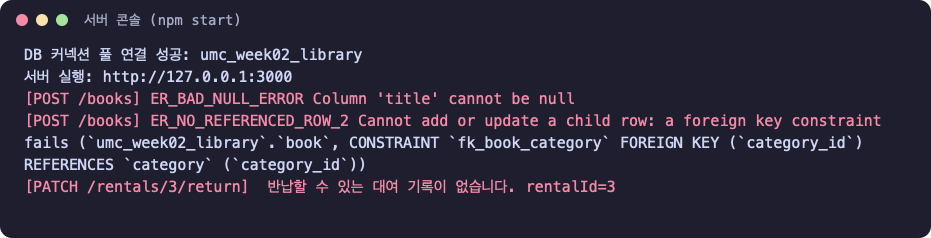
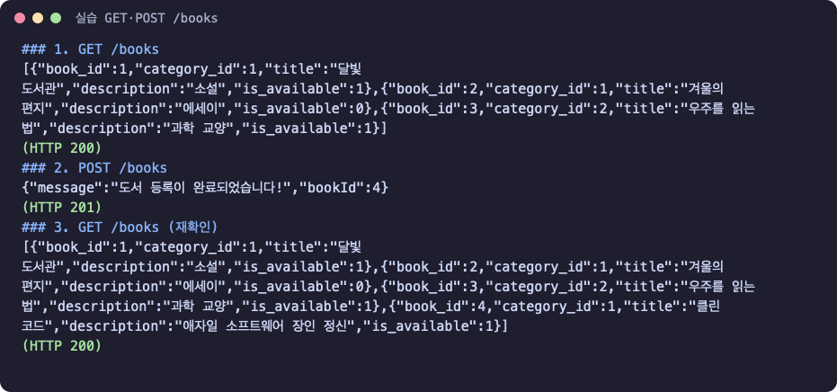
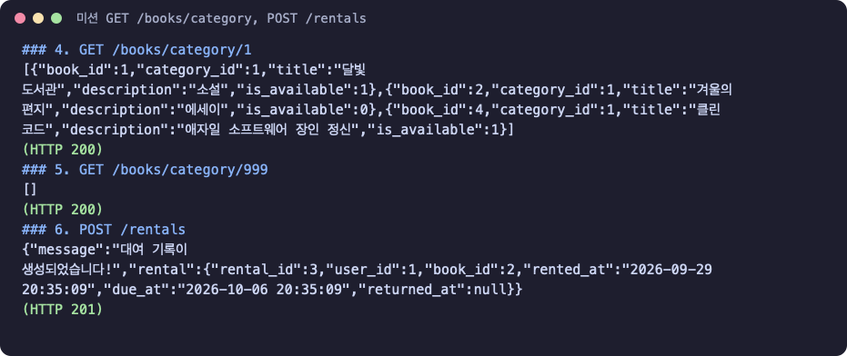
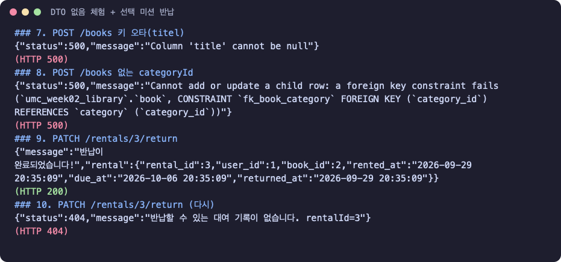

# 3주차 백엔드 미션: 첫 API 만들고 검증하기

## 미션 목표

2주차에 만든 온라인 도서 대여 DB(`umc_week02_library`)에 Node.js 서버를 붙여, 도서 조회·등록과 대여 생성 API를 만들고 요청으로 검증했다. 이번 주는 DTO·ORM 없이 Raw SQL로 작성해 그 불편함을 직접 겪어 보는 것이 목표다.

| 항목 | 내용 |
| --- | --- |
| 스택 | Node.js 24 · Express 5.2.1 · mysql2 3.24.4(커넥션 풀) · dotenv 18.0.4 |
| DB | 로컬 MySQL `umc_week02_library` (2주차 스키마·더미 데이터 그대로) |
| 환경변수 | 접속 정보는 `.env`로 분리, `.gitignore` 처리. `.env.example`만 공유 |
| 검증 도구 | curl로 요청하고 응답 본문·상태 코드를 기록(아래 실행 화면) |

## 폴더 구조

```text
umc-week3-backend/
├── .env.example
├── package.json
└── src/
    ├── index.js                          # 서버 시작, 오류 처리, DB 접속 확인
    ├── db.config.js                      # 커넥션 풀
    ├── controllers/library.controller.js # 요청·응답
    ├── services/library.service.js       # 규칙 판단(반납 가능 여부 등)
    └── repositories/library.repository.js# SQL
```

## 실행 화면

**서버 실행과 DB 연결**



**실습: GET /books, POST /books**



**미션: GET /books/category/{categoryId}, POST /rentals**



**DTO 없음 체험 + 선택 미션 반납**



## 실습 1 — DB 연결과 커넥션 풀

```js
// src/db.config.js
import 'dotenv/config';
import mysql from 'mysql2/promise';

export const pool = mysql.createPool({
  host: process.env.DB_HOST ?? 'localhost',
  port: Number(process.env.DB_PORT ?? 3306),
  user: process.env.DB_USER ?? 'root',
  password: process.env.DB_PASSWORD ?? '',
  database: process.env.DB_NAME ?? 'umc_week02_library',
  connectionLimit: 10,
  waitForConnections: true,
  dateStrings: true,
});
```

```js
// src/index.js (일부) — 서버를 띄우기 전에 연결을 하나 빌려 확인하고 반납
const conn = await pool.getConnection();
console.log('DB 커넥션 풀 연결 성공:', conn.config.database);
conn.release();

// 인증이 없는 실습용 API라 127.0.0.1에만 연다
app.listen(port, '127.0.0.1');
```

## 실습 2 — GET /books, POST /books

3계층으로 나눴다. Repository(SQL) → Service(규칙) → Controller(요청·응답) 순서로 작성했다.

```js
// repository
export async function findAllBooks() {
  const [rows] = await pool.query('SELECT * FROM book ORDER BY book_id');
  return rows;
}
export async function insertBook({ categoryId, title, description }) {
  const [result] = await pool.query(
    'INSERT INTO book (category_id, title, description, is_available) VALUES (?, ?, ?, TRUE)',
    [categoryId, title, description ?? null],
  );
  return result.insertId;
}

// controller
router.get('/books', async (req, res) => res.json(await service.getAllBooks()));
router.post('/books', async (req, res) => {
  const result = await service.createBook(req.body);
  res.status(201).json({ message: '도서 등록이 완료되었습니다!', ...result });
});
```

| 요청 | 결과 |
| --- | --- |
| `GET /books` | 200, 3권 |
| `POST /books` `{"categoryId":1,"title":"클린 코드","description":"애자일 소프트웨어 장인 정신"}` | 201, `bookId: 4` |
| `GET /books` 재확인 | 200, 4권 — 맨 끝에 `클린 코드` 추가 확인 |

`?` 자리표시자로 값을 넘겨 SQL Injection을 막았다. 문자열을 `+`로 이어 붙이지 않았다.

## 미션 1 (필수) — GET /books/category/{categoryId}

```js
// repository
export async function findBooksByCategoryId(categoryId) {
  const [rows] = await pool.query(
    'SELECT * FROM book WHERE category_id = ? ORDER BY book_id',
    [categoryId],
  );
  return rows;
}

// controller — Path Parameter를 숫자로 바꿔 넘긴다
router.get('/books/category/:categoryId', async (req, res) => {
  res.json(await service.getBooksByCategory(Number(req.params.categoryId)));
});
```

| 요청 | 결과 |
| --- | --- |
| `GET /books/category/1` (문학) | 200, 3권 (달빛 도서관 · 겨울의 편지 · 클린 코드) |
| `GET /books/category/999` | 200, `[]` — 없는 카테고리는 빈 배열 |

## 미션 2 (필수) — POST /rentals

```js
// repository — 대여일은 지금, 반납 예정일은 7일 뒤. returned_at은 NULL 허용이라 생략
export async function insertRental({ userId, bookId }) {
  const [result] = await pool.query(
    `INSERT INTO rental (user_id, book_id, rented_at, due_at)
     VALUES (?, ?, NOW(), DATE_ADD(NOW(), INTERVAL 7 DAY))`,
    [userId, bookId],
  );
  return result.insertId;
}

// controller
router.post('/rentals', async (req, res) => {
  const rental = await service.createRental(req.body);
  res.status(201).json({ message: '대여 기록이 생성되었습니다!', rental });
});
```

- 요청 `{"userId":1,"bookId":2}` → **201**, `rental_id: 3`
- `rented_at 2026-09-29 20:35:09`, `due_at 2026-10-06 20:35:09`(정확히 7일 뒤), `returned_at null`

## 선택 미션 — PATCH /rentals/{rentalId}/return

```js
// repository — 이미 반납한 기록은 건드리지 않는다
'UPDATE rental SET returned_at = NOW() WHERE rental_id = ? AND returned_at IS NULL'

// service — 바뀐 행이 0개면 반납할 수 없는 기록
if (changed === 0) throw new HttpError(404, `반납할 수 있는 대여 기록이 없습니다. rentalId=${rentalId}`);
```

| 요청 | 결과 |
| --- | --- |
| `PATCH /rentals/3/return` | 200, `returned_at` 기록 |
| 같은 요청 다시 | **404** — 반납일이 덮어써지지 않음 |

## Raw SQL과 DTO 없음의 문제 체험

| 실험 | 요청 | 결과 |
| --- | --- | --- |
| Key 오타 | `{"categoryId":1,"titel":"해리포터"}` | 실행 전엔 아무 오류 없음. `title`이 비어 **500** `Column 'title' cannot be null` |
| 없는 FK | `{"categoryId":999,"title":"유령 도서"}` | **500** `foreign key constraint fails` |
| 스키마 결합 | `GET /books` | `book_id`, `is_available: 1`처럼 DB 컬럼명·타입이 그대로 앱에 노출 |
| 규칙 없음 | `POST /rentals` bookId 2 | 이미 대여 중(`is_available = 0`)인 책도 대여가 만들어짐 |

→ 사용자 실수는 500이 아니라 400으로 알려야 하고, 응답 모양은 DB와 떼어 놓아야 한다. 4주차 DTO·ORM이 필요한 이유다. 대여 가능 여부 확인과 `is_available` 변경은 트랜잭션으로 묶는 것이 다음 과제다.

## 트러블슈팅

```text
증상: 없는 rentalId나 이미 반납한 기록에 PATCH해도 200이 나올 수 있음
원인: UPDATE는 조건에 맞는 행이 없어도 오류 없이 끝남(affectedRows = 0)
수정: Service에서 affectedRows가 0이면 404를 던지도록 판단
```

## 체크리스트

**실습**

- [x] 로컬 MySQL에 book, category, users, rental 테이블이 정상 생성되어 있다
- [x] 서버 콘솔에 에러 없이 DB 커넥션이 연결된다
- [x] GET /books 요청 시 도서 목록이 JSON 배열로 응답된다
- [x] POST /books 요청 시 새로운 데이터가 DB에 삽입된다

**미션**

- [x] (필수) GET /books/category/{categoryId}
- [x] (필수) POST /rentals — `NOW()`, `DATE_ADD(NOW(), INTERVAL 7 DAY)`
- [x] (선택) PATCH /rentals/{rentalId}/return — 중복 반납 404

## 실행 방법

```bash
cd umc-week3-backend
cp .env.example .env   # 비밀번호가 있다면 DB_PASSWORD 입력
npm install
npm start              # http://127.0.0.1:3000
```
