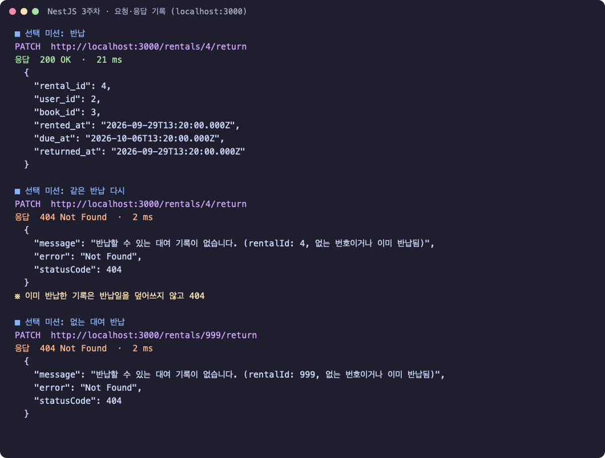
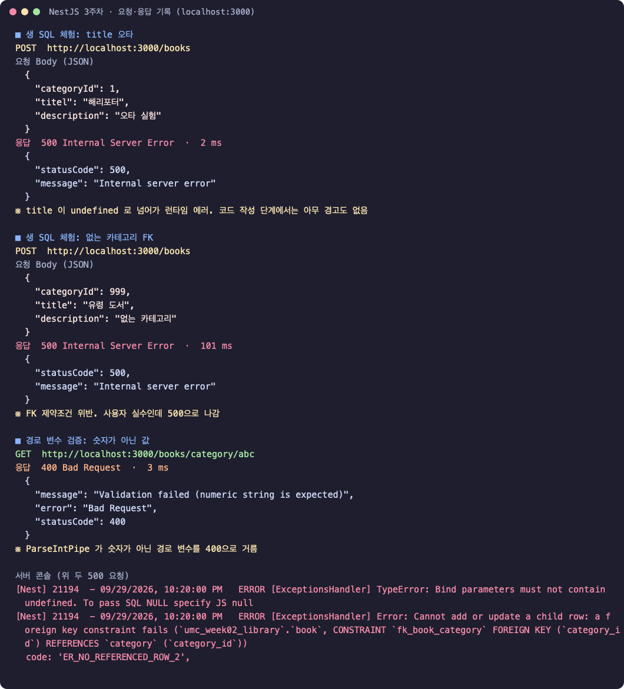
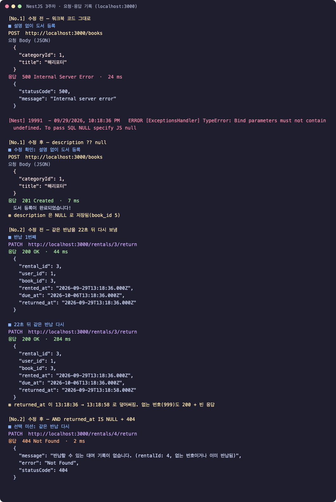

# 3주차 백엔드 미션: 첫 API 만들고 검증하기

## 미션 목표

2주차 온라인 도서 대여 DB(`umc_week02_library`)에 NestJS 서버를 붙여 도서 조회·등록, 카테고리별 조회, 대여 생성·반납 API를 만들고 요청으로 검증했다. 워크북 방식대로 DTO·ORM 없이 Raw SQL과 수동 매핑으로 작성해, 4주차 ORM·DTO가 왜 필요한지 직접 겪어 보는 것이 목표다.

| 항목 | 내용 |
| --- | --- |
| 스택 | NestJS 12(Node.js 24, TypeScript) · mysql2 3.24.4 커넥션 풀 · @nestjs/config |
| 코드 | [11th_BE_NodeJs_Practice_Mission #6](https://github.com/UMC-Inha/11th_BE_NodeJs_Practice_Mission/pull/6) (`kevin/main` 대상) |
| DB | 로컬 MySQL `umc_week02_library` (2주차 스키마·더미 데이터 그대로) |
| 환경변수 | DB 접속 정보는 `.env`로 분리(`.gitignore` 처리), `.env.example`만 공유 |
| 검증 | 요청 13개를 보내 URL·Body·상태 코드·응답 JSON을 기록(아래 실행 화면) |

## 폴더 구조

워크북대로 `src/` 바로 아래에 계층별 파일을 둔다.

```text
src/
├── main.ts                 # 서버 시작, DB 연결 확인, 127.0.0.1에만 열기
├── app.module.ts           # ConfigModule + DB Provider + 도서·대여 부품 등록
├── database.provider.ts    # mysql2 커넥션 풀 (DATABASE_CONNECTION 토큰)
├── book.controller.ts      # 웨이터: 요청·응답
├── book.service.ts         # 셰프: 규칙
├── book.repository.ts      # 창고지기: SQL
├── rental.controller.ts
├── rental.service.ts
└── rental.repository.ts
```

## 실행 화면

**서버 실행과 DB 커넥션 연결** — 라우트 6개 등록, `DB 커넥션 풀 연결 성공`


**[실습] GET /books → POST /books → GET /books 재확인**


**[필수 미션] GET /books/category/{categoryId}, POST /rentals**


**[선택 미션] PATCH /rentals/{rentalId}/return**



> 캡처는 Postman 대신 요청 스크립트(Node fetch)로 보낸 요청·응답을 그대로 그린 화면이다. 이 맥에는 Postman이 없어서, 같은 요청을 Postman으로 다시 보내 캡처할 예정이다.

## 실습 — DB 연결 통로(Provider)와 GET·POST /books

`database.provider.ts`와 `app.module.ts`는 워크북 코드 그대로다. 이 레포는 ESM(`"type": "module"`)이라 상대 경로 import에 `.js`를 붙였다.

```ts
// src/book.repository.ts
@Injectable()
export class BookRepository {
  constructor(@Inject(DATABASE_CONNECTION) private readonly pool: Pool) {}

  async findAll(): Promise<any> {
    const [rows] = await this.pool.query('SELECT * FROM book');
    return rows;
  }

  async create(body: Record<string, any>): Promise<any> {
    const sql =
      'INSERT INTO book (category_id, title, description, is_available) VALUES (?, ?, ?, true)';
    // description은 NULL 허용 컬럼이라 안 보냈으면 null로 넘긴다(트러블슈팅 No.1)
    const [result] = await this.pool.execute(sql, [body.categoryId, body.title, body.description ?? null]);
    return result;
  }
}
```

```ts
// src/book.service.ts
async createBook(body: Record<string, any>): Promise<string> {
  await this.bookRepository.create(body);
  return '도서 등록이 완료되었습니다!';
}

// src/book.controller.ts
@Controller('books')
export class BookController {
  @Get()
  async getBooks(): Promise<any> { return await this.bookService.getAllBooks(); }

  @Post()
  async createBook(@Body() body: Record<string, any>): Promise<string> {
    return await this.bookService.createBook(body);
  }
}
```

| 요청 | 결과 |
| --- | --- |
| `GET /books` | 200, 3권 |
| `POST /books` `{"categoryId":1,"title":"클린 코드","description":"애자일 소프트웨어 장인 정신"}` | 201, `도서 등록이 완료되었습니다!` |
| `GET /books` 재확인 | 200, 4권 — 맨 끝에 `클린 코드`(book_id 4) |

값은 전부 `?` 자리에 넘겨 SQL Injection을 막았다. 문자열을 `+`로 이어 붙이지 않았다.

## 필수 미션 1 — GET /books/category/{categoryId}

```ts
// repository
async findByCategoryId(categoryId: number): Promise<any> {
  const [rows] = await this.pool.execute('SELECT * FROM book WHERE category_id = ?', [categoryId]);
  return rows;
}

// controller — Path Variable을 숫자로 받는다(Spring의 @PathVariable Long과 같은 역할)
@Get('category/:categoryId')
async getBooksByCategory(@Param('categoryId', ParseIntPipe) categoryId: number): Promise<any> {
  return await this.bookService.getBooksByCategory(categoryId);
}
```

| 요청 | 결과 |
| --- | --- |
| `GET /books/category/1` (문학) | 200, 3권 (달빛 도서관 · 겨울의 편지 · 클린 코드) |
| `GET /books/category/999` | 200, `[]` — 없는 카테고리는 빈 배열 |
| `GET /books/category/abc` | 400 — `ParseIntPipe`가 숫자가 아닌 값을 거름 |

## 필수 미션 2 — POST /rentals

```ts
// repository — rental_id는 AUTO_INCREMENT, returned_at은 NULL 허용이라 생략
async create(body: Record<string, any>): Promise<any> {
  const sql =
    'INSERT INTO rental (user_id, book_id, rented_at, due_at) VALUES (?, ?, NOW(), DATE_ADD(NOW(), INTERVAL 7 DAY))';
  const [result] = await this.pool.execute(sql, [body.userId, body.bookId]);
  return result;
}

// service — INSERT 결과에는 insertId만 있어서, 날짜 확인용으로 방금 만든 행을 다시 읽는다
async createRental(body: Record<string, any>): Promise<any> {
  const result = await this.rentalRepository.create(body);
  const [rental] = await this.rentalRepository.findById(result.insertId);
  return rental;
}
```

- 요청 `{"userId":2,"bookId":3}` → **201**, `rental_id: 4`
- DB 값: `rented_at 2026-09-29 22:20:00`, `due_at 2026-10-06 22:20:00` — 정확히 7일 뒤, `returned_at NULL`

## 선택 미션 — PATCH /rentals/{rentalId}/return

```ts
// repository — 워크북 쿼리에 조건 하나를 더했다(트러블슈팅 No.2)
'UPDATE rental SET returned_at = NOW() WHERE rental_id = ? AND returned_at IS NULL'

// service — 바뀐 행이 0개면 없는 번호이거나 이미 반납한 기록
if (result.affectedRows === 0) {
  throw new NotFoundException(`반납할 수 있는 대여 기록이 없습니다. (rentalId: ${rentalId}, 없는 번호이거나 이미 반납됨)`);
}
```

| 요청 | 결과 |
| --- | --- |
| `PATCH /rentals/4/return` | 200, `returned_at` 기록 |
| 같은 요청 다시 | **404** — 반납일이 덮어써지지 않음 |
| `PATCH /rentals/999/return` | **404** |

## 생 SQL & No DTO의 대환장 파티 — 직접 겪은 것



| 실험 | 결과 | 느낀 점 |
| --- | --- | --- |
| `"titel"` 오타로 등록 | **500** `Bind parameters must not contain undefined` | 코드 작성 단계에서는 빨간 줄 하나 없다. 요청을 보내 봐야 안다 |
| 없는 `categoryId: 999` | **500** `ER_NO_REFERENCED_ROW_2` (FK 위반) | 사용자 실수인데 서버 에러(500)로 나간다. 400으로 알려야 한다 |
| `GET /books` 응답 모양 | `book_id`, `is_available: 1` | DB 컬럼명(snake_case)과 `TINYINT` 값이 그대로 앱에 노출된다 |
| 대여 응답의 날짜 | `2026-09-29T13:20:00.000Z` | DB에는 한국 시간 22:20인데 응답은 UTC로 바뀌어 나간다. 변환 규칙을 한곳에서 정하지 않으면 화면마다 시간이 달라진다 |
| 대여 중인 책 규칙 | 검사 없음 | 대여를 만들어도 `is_available`이 그대로다. 대여 가능 여부 확인과 상태 변경은 Service 규칙 + 트랜잭션으로 묶어야 한다(4주차) |

## 트러블 슈팅



**⚡ 이슈 No.1**

- 이슈: 👉 `description` 없이 `POST /books`를 보내면 500 Internal Server Error가 났다. 서버 콘솔에는 `TypeError: Bind parameters must not contain undefined. To pass SQL NULL specify JS null`
- 문제: 👉 `pool.execute()`는 prepared statement라 바인딩 값에 `undefined`가 있으면 쿼리를 보내기 전에 막는다. Body에 없는 키를 꺼내면 `undefined`가 된다. `description`은 DB에서 NULL을 허용하는 컬럼인데도 요청 단계에서 막혔다
- 해결: 👉 NULL 허용 컬럼만 `body.description ?? null`로 넘겼다. 필수 컬럼 `title`은 그대로 두어, 빠지면 에러가 나게 했다(4주차 DTO 검증으로 400 처리 예정)
- 참고레퍼런스: [mysql2 문서 - Prepared Statements](https://sidorares.github.io/node-mysql2/docs/documentation/prepared-statements)

**⚡ 이슈 No.2**

- 이슈: 👉 이미 반납한 대여에 `PATCH /rentals/3/return`을 한 번 더 보내니 200이 나오고 `returned_at`이 13:18:36 → 13:18:58(UTC)로 바뀌었다. 없는 번호(`/rentals/999/return`)도 200에 빈 응답이었다
- 문제: 👉 `UPDATE rental SET returned_at = NOW() WHERE rental_id = ?`는 이미 반납한 행도 다시 바꾼다. 그리고 `UPDATE`는 바꿀 행이 없어도 에러 없이 끝난다(`affectedRows = 0`)
- 해결: 👉 조건에 `AND returned_at IS NULL`을 붙여 아직 반납하지 않은 기록만 바꾸고, Service에서 `affectedRows === 0`이면 `NotFoundException`(404)을 던졌다
- 참고레퍼런스: [MySQL 8.4 - UPDATE Statement](https://dev.mysql.com/doc/refman/8.4/en/update.html), [NestJS - Built-in HTTP exceptions](https://docs.nestjs.com/exception-filters#built-in-http-exceptions)

## 체크리스트

**실습**

- [x] 로컬 MySQL에 book, category, users, rental 테이블이 정상 생성되어 있다
- [x] 서버 콘솔에 에러 없이 DB 커넥션이 연결된다
- [x] GET /books 요청 시 도서 목록이 JSON 배열로 잘 응답된다
- [x] POST /books 요청 시 새로운 데이터가 DB에 정상 삽입된다

**미션**

- [x] (필수) GET /books/category/{categoryId} — `WHERE category_id = ?`
- [x] (필수) POST /rentals — `NOW()`, `DATE_ADD(NOW(), INTERVAL 7 DAY)`
- [x] (선택) PATCH /rentals/{rentalId}/return — 중복 반납·없는 번호 404

## 실행 방법

```bash
cp .env.example .env   # DB_PASSWORD 등 로컬 MySQL 정보 입력
npm ci
npm run start:dev      # http://localhost:3000
```
