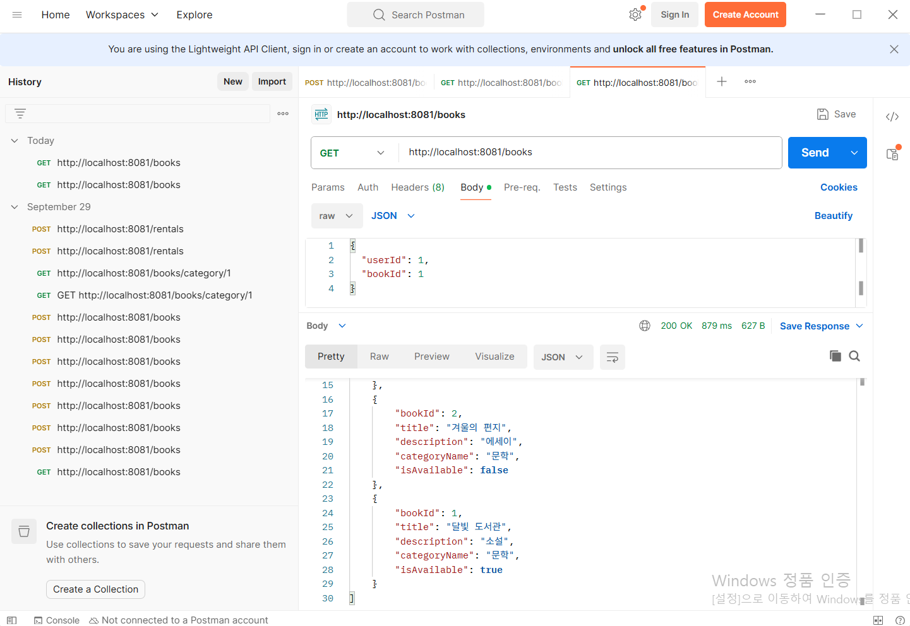
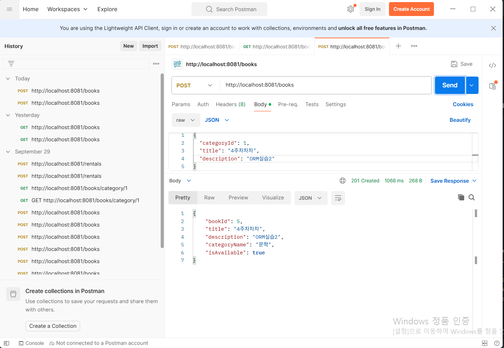
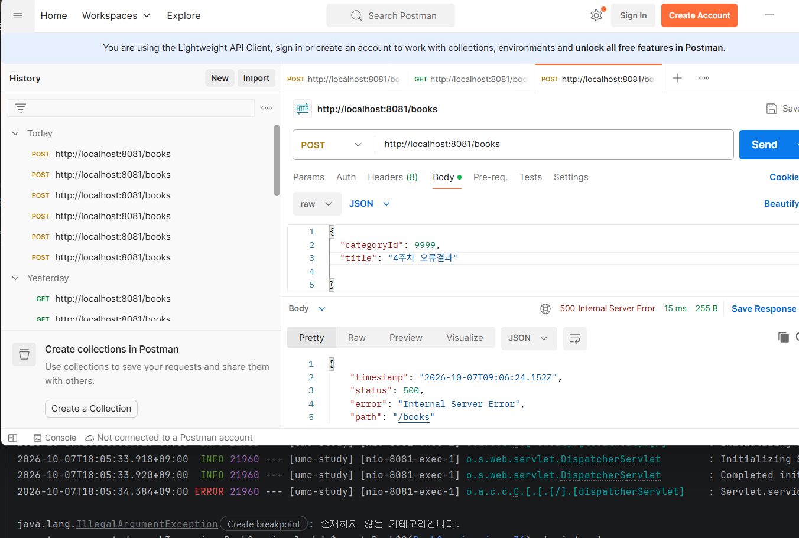

## Week 4 Mission

### 1. GitHub 저장소

<https://github.com/qwedus/11th_BE_Spring_Practice_Mission/tree/week4-orm>

### 2. 실행 결과 화면

**GET /books**

**POST /books**

**오류 응답**

### 3. 3주차 Raw SQL 방식과 비교해 바뀐 점

3주차에는 `BookRepository`에서 `JdbcTemplate`으로 `SELECT * FROM book`, `INSERT INTO book ... VALUES (?, ?, ?, true)` 같은 SQL 문자열을 직접 작성하고 물음표 순서에 맞춰 파라미터를 넘겼습니다.

반면 4주차에는 다음과 같이 바뀌었습니다.

- **엔티티 매핑**: `Book`, `Category` 엔티티로 테이블과 다대일 관계를 표현했습니다.
- **Repository**: `BookRepository`를 `JpaRepository` 인터페이스로 바꿔 `findAllByOrderByBookIdDesc()`처럼 메서드 이름만으로 조회와 저장을 처리했습니다.
- **DTO 분리**: 요청과 응답을 `Map<String, Object>` 대신 `CreateBookRequest`, `BookResponse` DTO로 분리해서, `book_id`, `category_id` 같은 DB 컬럼명이 그대로 노출되지 않고 `bookId`, `categoryName`처럼 필요한 값만 내려가게 됐습니다.
- **입력 검증**: `@Valid`로 빈 제목이나 누락된 `categoryId`를 Controller에서 걸러내고, 등록 전에 카테고리 존재 여부를 확인하도록 해서 3주차에는 없던 입력 검증이 생겼습니다.
- **등록 응답**: 안내 문자열 대신 `201 Created`와 함께 저장된 도서 정보를 반환하도록 바뀌었습니다.

### 4. 실행 결과 검증 한 문장

`GET /books`는 도서 ID·제목·설명·카테고리 이름·대여 가능 여부를 최신순으로 `200`과 함께 반환했고, `POST /books`는 도서를 등록한 뒤 `201`을 반환했으며, 빈 제목 요청은 `400`, 존재하지 않는 카테고리 요청은 저장 없이 오류로 응답해 요구사항과 일치함을 확인했습니다.
