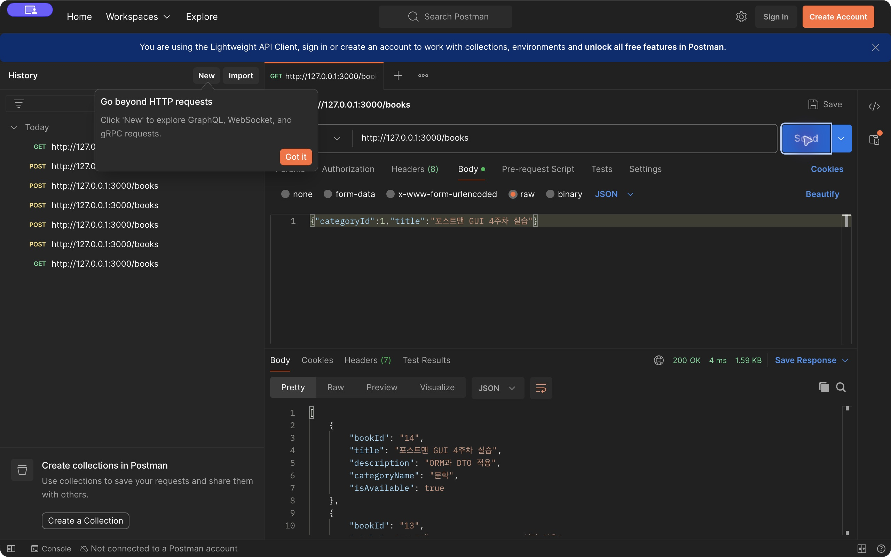
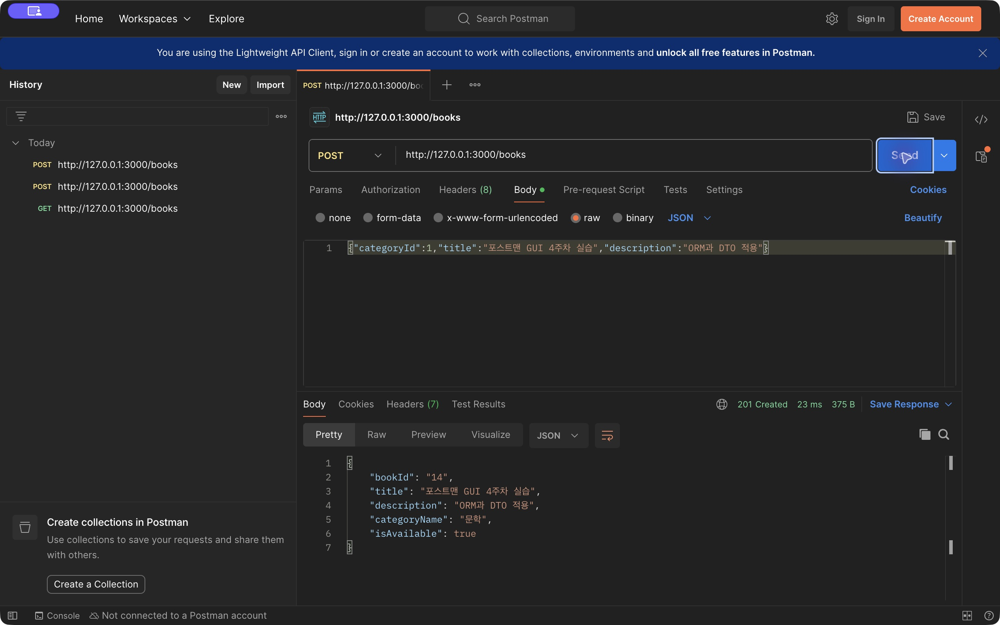
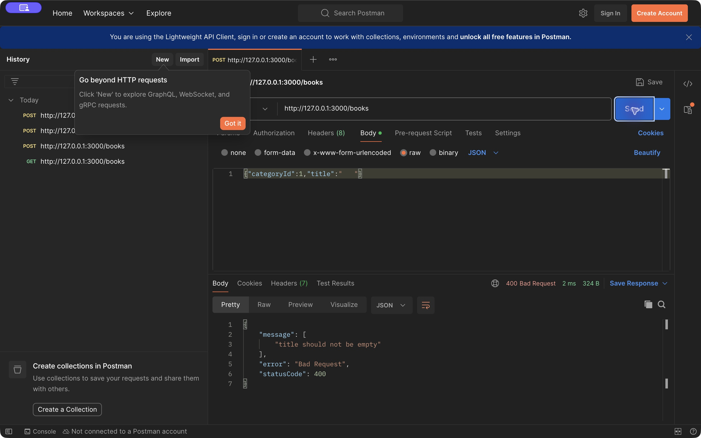
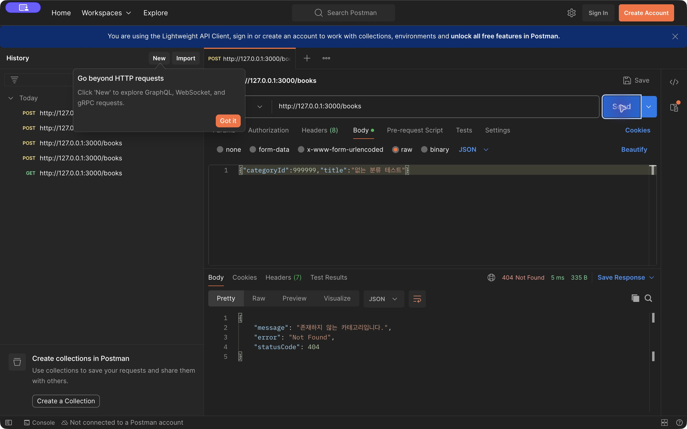
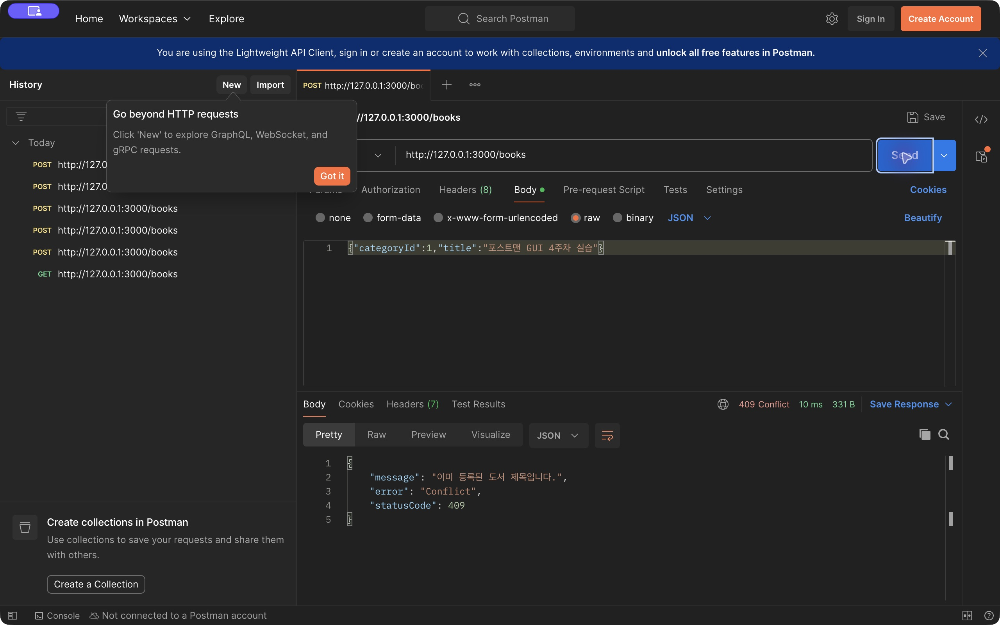

# 4주차 백엔드 미션 — TypeORM과 DTO 도서 API

- 이름 / 닉네임: 케빈
- 선택 스택: NestJS + TypeORM 0.3 + MySQL
- [GitHub 실습 저장소](https://github.com/brownglasses/11th_BE_NodeJs_Practice_Mission/tree/codex/week04-orm)
- Pull Request: [실습 PR #9](https://github.com/UMC-Inha/11th_BE_NodeJs_Practice_Mission/pull/9)
- [원본 워크북](https://makeus-challenge.notion.site/4-ORM-API-1-3f2b57f4596b80929a50e1d49c8e9c70)
- [핵심 키워드](../../../keyword/Backend/chapter04/keyword.md)

## 실습·필수·선택 구현

- [x] 기존 Raw SQL 버전을 `brownglasses/week03` 브랜치와 기존 Repository 파일에 보존
- [x] Book·Category PK/FK와 Category 1:N Book 관계 매핑
- [x] TypeOrmModule 연결·forFeature Repository 주입, synchronize:false
- [x] GET /books 최신 bookId DESC, 요구된5필드 Response DTO
- [x] POST /books 입력 DTO → 카테고리 확인 → create/save →201
- [x] 빈/공백/100자 초과 제목, 잘못된 타입400; 없는 카테고리404
- [x] 선택1 categoryName 포함, Entity 전체를 응답하지 않음
- [x] 선택2 GET /books?keyword=제목 부분 검색
- [x] 선택3 Migration으로 title UNIQUE, 중복409(동시 요청 포함)

## 핵심 코드 링크

[Book Entity](https://github.com/brownglasses/11th_BE_NodeJs_Practice_Mission/blob/codex/week04-orm/src/book.entity.ts), [Category Entity](https://github.com/brownglasses/11th_BE_NodeJs_Practice_Mission/blob/codex/week04-orm/src/category.entity.ts), [DTO](https://github.com/brownglasses/11th_BE_NodeJs_Practice_Mission/blob/codex/week04-orm/src/book.dto.ts), [Repository 등록](https://github.com/brownglasses/11th_BE_NodeJs_Practice_Mission/blob/codex/week04-orm/src/books.module.ts), [Service](https://github.com/brownglasses/11th_BE_NodeJs_Practice_Mission/blob/codex/week04-orm/src/book.service.ts), [Controller](https://github.com/brownglasses/11th_BE_NodeJs_Practice_Mission/blob/codex/week04-orm/src/book.controller.ts), [Migration](https://github.com/brownglasses/11th_BE_NodeJs_Practice_Mission/blob/codex/week04-orm/src/migrations/1791342000000-UniqueBookTitle.ts).

```ts
const books = await this.books.find({
  where: escaped ? { title: Like(`%${escaped}%`) } : {},
  relations: { category: true },
  order: { bookId: 'DESC' },
});
return books.map((book) => BookResponseDto.from(book));
```

기존 실제 DB의 BIGINT 타입을 그대로 매핑했다. bookId는 JavaScript 숫자 정밀도를 보존하는 문자열, isAvailable은 boolean, 설명 미입력은 null로 반환한다. categoryId 요청은 양의 안전한 정수만 허용하며 숫자 문자열은400이다.

## 실제 Postman 인증

실행 중인 NestJS 서버와 실제 MySQL 실습 DB에 Postman 데스크톱 앱의 요청을 보낸 화면이다.

### GET /books → 200



등록한 bookId14가 먼저 나오며 categoryName·isAvailable이 요구한 형태로 응답된다.

### POST /books → 201

요청: `{"categoryId":1,"title":"포스트맨 GUI 4주차 실습","description":"ORM과 DTO 적용"}`



### 잘못된 제목400 / 없는 카테고리404 / 중복409





## 추가 검증 자료

[실제 API 요청·응답20건](evidence/week04-api-results.json), [Postman Collection](evidence/week04.postman_collection.json), [Newman 실제 실행 결과](evidence/week04-newman.json).

| 검증 | 결과 |
| --- | --- |
| 전체 목록·최신순·정확한 응답 필드·boolean | 200 정상 |
| 정상 등록 후 목록 확인 | 201, 새 행 확인 |
| keyword 검색 / 결과 없음 / % 문자 검색 | 200, 일치 목록 / [] / 와일드카드 문자 처리 |
| 빈·공백·누락·101자 제목 | 400 |
| categoryId 문자열·0 | 400 |
| 없는 categoryId | 404 |
| 미정의 요청 필드·잘못된 description 타입 | 400 |
| description 생략 | 201, null |
| 중복 제목 | 409 |
| 같은 제목 동시 등록2건 | 201·409, DB에1건만 생성 |
| 기존 카테고리 조회·숫자 아닌 Path | 200·400 |

`npm run build`, `npm test`(1개), `npm run lint`가 성공했다. `npm run verify:week04`의 실제 서버·DB20개 검사와 Newman의8개 요청·10개 assertion 모두 통과했다. 검증 스크립트는 실행할 때마다 테스트 도서3건을 추가하므로 별도 실습 DB에서만 사용한다.

**결과 검증:** GET 최신순·DTO, POST201, 입력400·없는 분류404·중복409가 실제 서버와 DB에서 모두 요구사항과 일치했다.

## 중간 진행 기록

1. 3주차 브랜치를 보존하고 기존 book/category 스키마의 컬럼명·BIGINT·NULL·FK를 확인했다.
2. 기존 `umc_week02_library`를 바꾸지 않고 스키마와 행을 별도 `umc_week04_library`로 복사했다. 복사 스크립트는 대상이 이미 있으면 덮어쓰지 않는다.
3. Category→Book 관계를 Entity로 매핑하고 BooksModule에서 Repository를 주입했다. 기존 도서 Raw SQL Repository는 등록 대상에서 제외했다.
4. Request DTO와 전역 ValidationPipe를 추가했다. title을 trim해 공백 제목도400으로 거르고 카테고리 조회 실패를404로 분리했다.
5. Response DTO를 도입해 관계 객체·DB 내부 이름을 응답에서 제거했다. 기존 대여 API는 3주차 구조로 유지했다.
6. 검색은 ORM 바인딩을 사용하고 LIKE 특수 문자를 일반 문자로 처리했다. title UNIQUE Migration을 별도 실행하고 DB 중복 오류를409로 변환했다.
7. compiled NestJS 앱과 실제 MySQL 검증, Postman Collection/Newman, 실제 Postman GUI 요청으로 정상·예외 결과를 확인했다.

## Raw SQL과 달라진 점 — 비교 기록

3주차에는 SQL 문자열과 물음표 파라미터 순서를 직접 관리했지만 이번에는 Entity 매핑과 Repository find/create/save로 CRUD 의도를 표현했다. DB의 book_id와 숫자형 is_available을 그대로 전달하던 응답은 bookId와 boolean을 가진 DTO로 고정했다. 잘못된 제목과 타입은 DB에 보내기 전에400으로 거르고, 존재하지 않는 카테고리는 Service에서404로 알려 이전 FK 오류500을 구체적인 오류로 바꿨다. ORM도 내부적으로 SQL을 실행하므로 PK/FK·관계·트랜잭션·성능 확인은 여전히 필요하다.

## 트러블슈팅

### No.1 Migration 실행 파일 경로

- 이슈: CLI가 dist/src/data-source.js를 찾지 못했다.
- 원인: build 설정의 rootDir가 src여서 실제 출력은 dist/data-source.js였다.
- 해결: migration:run/revert의 DataSource 경로를 실제 출력에 맞추고 다시 실행했다. UNIQUE Migration 성공 후 실제 중복·동시 등록409를 확인했다.

### No.2 입력 형식 오류가 DB 예외가 되지 않게 하기

- 이슈: 3주차 실험에서 title 누락은 undefined 바인딩500, 없는 categoryId는 FK 오류500이었다.
- 원인: 요청이 any 형태로 DB 계층까지 내려갔다.
- 해결: IsString·IsNotEmpty·MaxLength·IsInt 및 전역 ValidationPipe를 적용했다. 공백 제목은 trim 후 검증하고 카테고리 존재 여부는 별도 조회했다. 이번 실제 요청에서400·404로 확인했다.

### No.3 중복 조회만으로는 동시 등록을 막을 수 없음

- 문제: 두 요청이 동시에 중복 검사에 통과할 수 있다.
- 해결: title UNIQUE를 DB에 적용하고 ER_DUP_ENTRY를409로 매핑했다. 실제 동시에 보낸2요청의 결과가201·409이고 같은 제목 행은1건임을 검증했다.

## 학습 후기

ORM으로 바꾸면서 반복 SQL보다 도서·카테고리 관계와 API 계약이 코드에서 더 잘 보였다. DTO는 응답 필드 정리뿐 아니라 잘못된 입력을 DB 예외까지 보내지 않는 경계로 작동했다. JPA의 영속성 컨텍스트와 TypeORM의 create/save는 동작이 다르므로 하나의 ORM 지식을 다른 라이브러리에 그대로 적용하면 안 된다는 점을 정리했다. 다음에는 대여 업무의 상태 변경을 트랜잭션으로 묶고 실제 쿼리 수와 N+1을 측정하는 연습이 필요하다.
