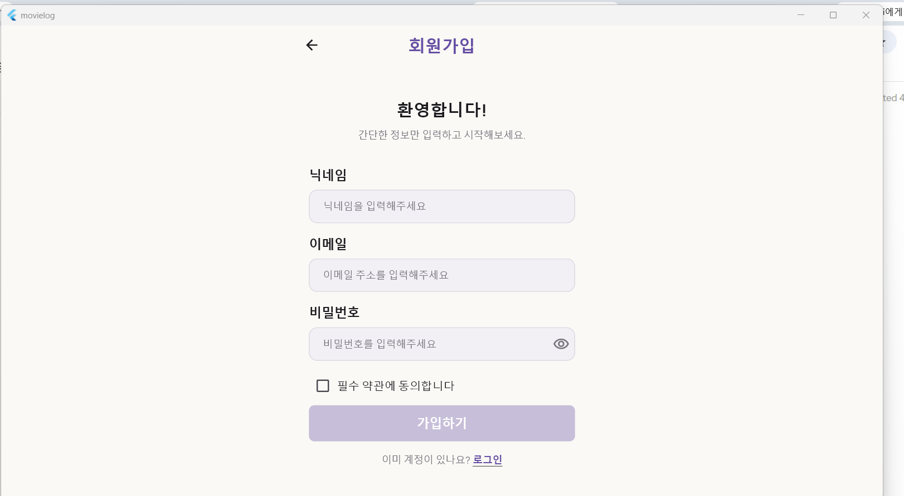
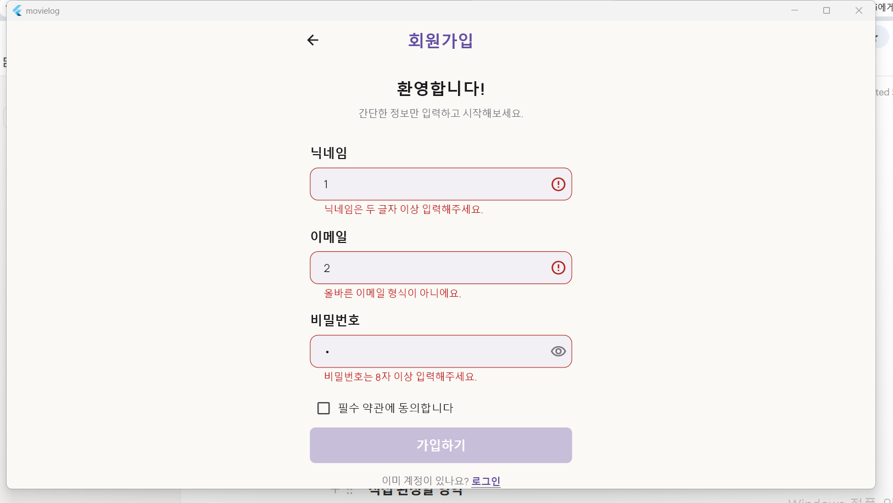
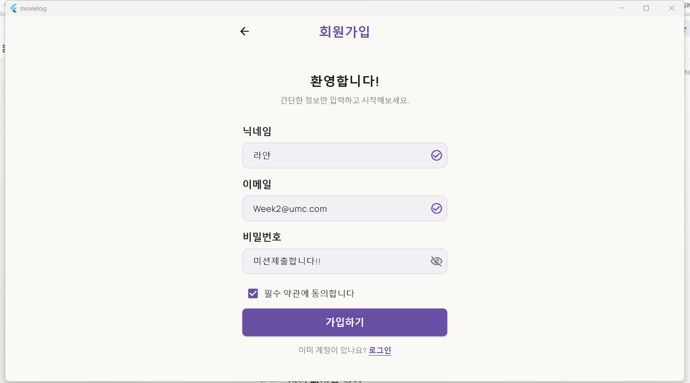

## Week 2 Mission

이름 / 닉네임: 백권희 / 라얀
GitHub 저장소: qwedus
Pull Request: O
입력 전 화면: 
Validation 오류 화면: 
입력 완료 화면: 
평점 선택 화면: 
넓은 화면 Challenge — 선택: x
Validator 규칙:
  - 닉네임: 빈 값("닉네임을 입력해주세요.") / 두 글자 미만("닉네임은 두 글자 이상 입력해주세요.")
  - 이메일: 빈 값("이메일을 입력해주세요.") / 정규식 불일치("올바른 이메일 형식이 아니에요.")
  - 비밀번호: 빈 값("비밀번호를 입력해주세요.") / 8자 미만("비밀번호는 8자 이상 입력해주세요.")
선택한 평점: -
dispose한 객체:
  - _nicknameController, _emailController, _passwordController (TextEditingController)
  - _emailFocusNode, _passwordFocusNode (FocusNode)
사용한 반응형 기준:
  - LayoutBuilder의 constraints.maxWidth >= 700 → Form을 Center + ConstrainedBox(maxWidth: 560)로 제한
  - 700 미만은 ConstrainedBox(maxWidth: double.infinity)로 부모가 주는 폭 그대로 사용
트러블슈팅: 
2주차 회고: