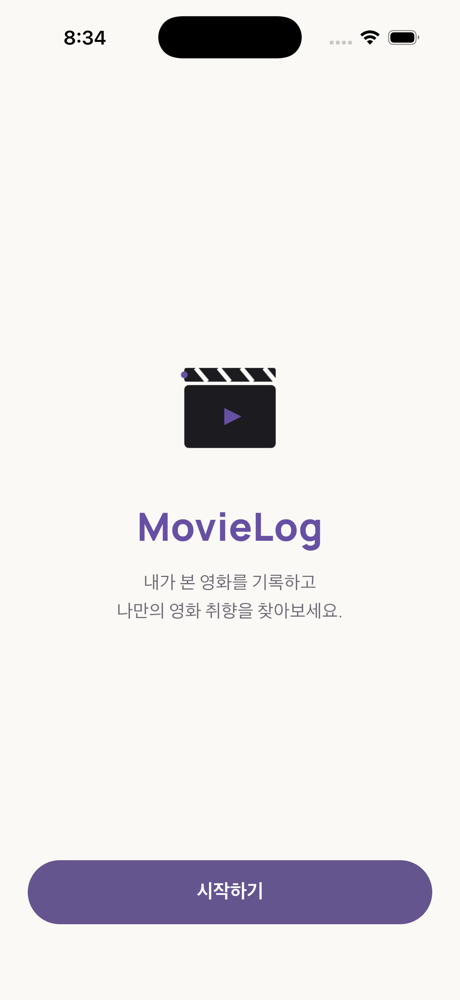
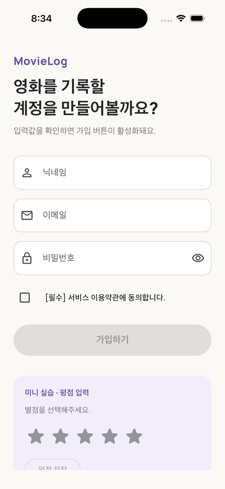
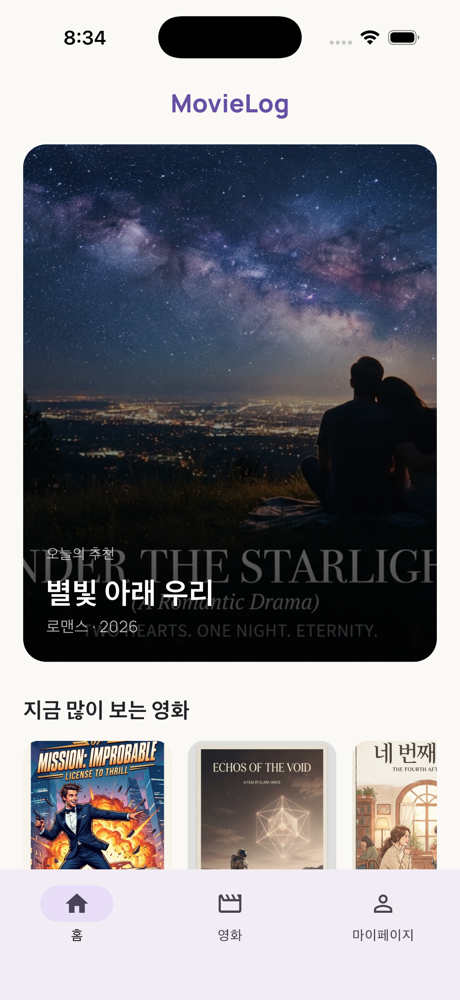
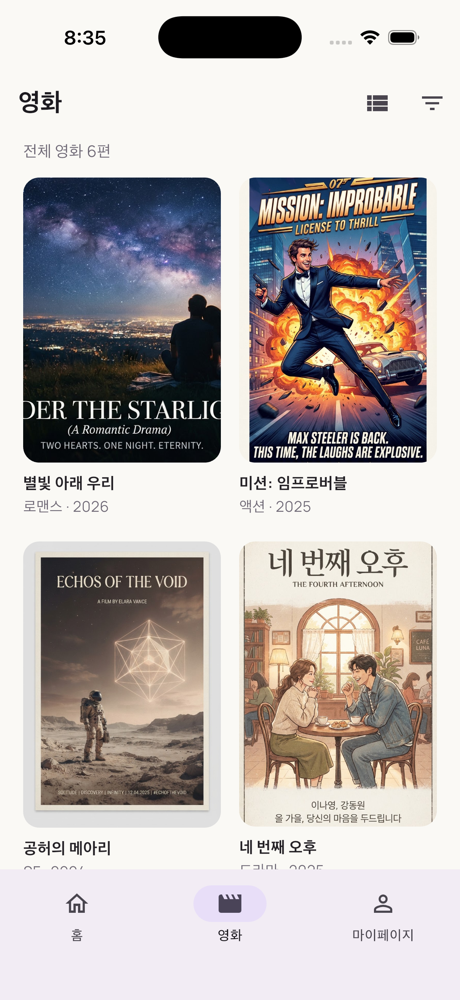
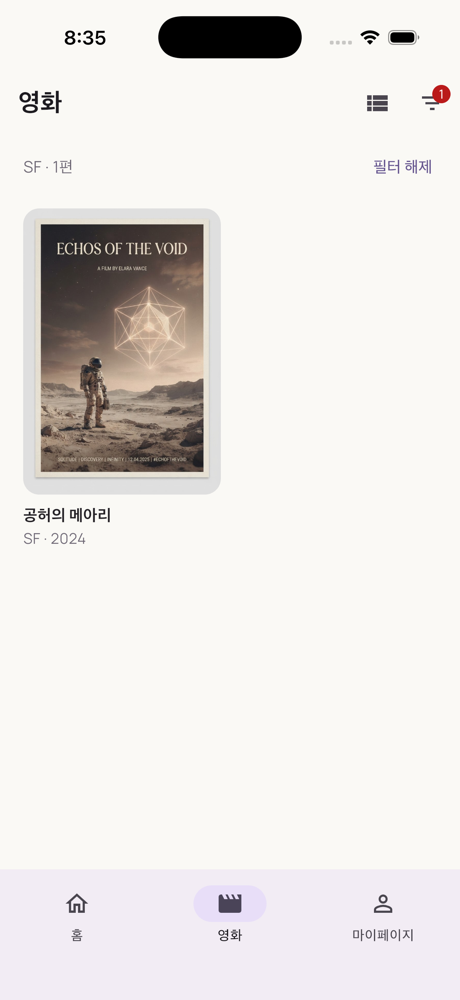
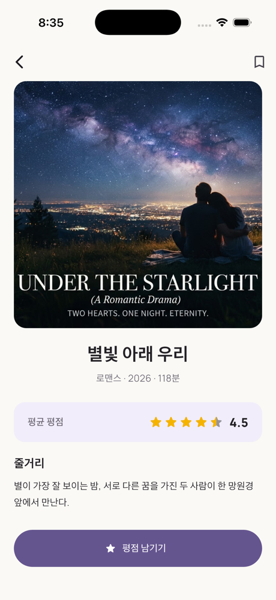
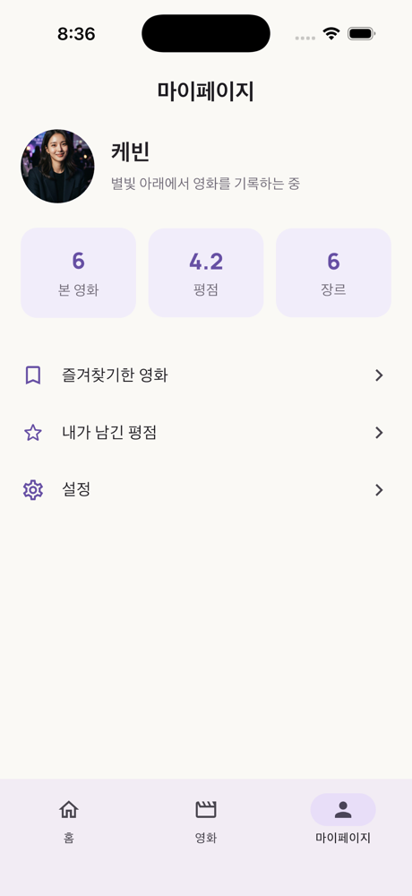

# 3주차 프론트엔드 미션: MovieLog 기본 사용자 흐름

## 미션 목표

3주차 워크북의 Required Mission에 맞춰 MovieLog의 네 화면(홈·영화 목록·영화 상세·마이페이지)을 GoRouter로 연결했다. 실제 API·인증·Provider·MVVM은 쓰지 않고, 모든 데이터는 Mock Data와 화면 내부 상태로만 처리했다.

- 실습 코드 PR: [UMC-Inha/11th_PE_Mobile_Flutter_Practice_Mission #2](https://github.com/UMC-Inha/11th_PE_Mobile_Flutter_Practice_Mission/pull/2)

| 시작 | 회원가입 | 홈 |
| --- | --- | --- |
|  |  |  |

| 영화 목록 | 장르 필터(SF) | 영화 상세 | 마이페이지 |
| --- | --- | --- | --- |
|  |  |  |  |

## 제출 양식

```text
이름 / 닉네임: 케빈
GitHub 저장소: https://github.com/brownglasses/11th_PE_Mobile_Flutter_Practice_Mission
Pull Request: https://github.com/UMC-Inha/11th_PE_Mobile_Flutter_Practice_Mission/pull/2
사용한 go_router 버전: 18.0.2
Route 목록:
  /                    시작하기
  /sign-up             회원가입
  /home                홈 (탭 0)
  /movies              영화 목록 (탭 1, ?genres=SF,드라마)
  /my                  마이페이지 (탭 2)
  /movies/:movieId     영화 상세 (탭 바깥 전체 화면)
go / push / pop 사용 위치:
  go   - 시작 → 회원가입, 회원가입 → 홈, 장르 필터 적용(URL 교체)
  push - 홈·목록의 영화 카드 → 상세
  pop  - 상세의 뒤로 가기, Dialog·BottomSheet 닫기(Navigator.pop으로 결과 반환)
Path Parameter 사용 위치: /movies/:movieId → state.pathParameters['movieId'] → findMovieById
Query Parameter와 Extra 비교:
  선택 장르는 /movies?genres=SF 처럼 Query로 URL에 남겼다. 주소만으로 같은 목록을 다시 열 수 있다.
  Extra는 객체를 통째로 넘길 수 있지만 URL에 남지 않아 새로고침·딥링크에서 사라진다.
  그래서 상세도 Movie 객체(Extra) 대신 ID(Path)만 넘기고 Mock Data에서 다시 찾았다.
Dialog / BottomSheet / Snackbar 사용 위치:
  Dialog      - 상세 '평점 남기기' → MovieRatingDialog (MovieRatingInput 포함)
  BottomSheet - 목록 오른쪽 위 필터 아이콘 → GenreFilterSheet (DraggableScrollableSheet)
  Snackbar    - 즐겨찾기 추가/삭제, 평점 저장, 가입 완료
전체 사용자 흐름 영상: (직접 녹화 후 첨부 예정)
트러블슈팅: 아래 참고
3주차 회고: 아래 참고
```

## 구현 결과

| 요구사항 | 구현 |
| --- | --- |
| 네 화면 구현 | `HomeScreen`, `MovieListScreen`, `MovieDetailScreen`, `MyPageScreen` |
| 같은 Theme·Mock Data | 모든 화면이 `AppTheme.light`와 `core/data/mock_movies.dart`의 `mockMovies`를 사용 |
| NavigationBar 탭 전환 | `StatefulShellRoute.indexedStack` + `NavigationBar(selectedIndex: navigationShell.currentIndex)` |
| 카드 Tap | 공통 `MovieCard`, `MovieListTile`이 `GestureDetector(onTap)`로 이동 |
| Path Parameter 상세 이동 | `context.push('/movies/${movie.id}')` → `state.pathParameters['movieId']` |
| 상세 뒤로 가기 | push로 쌓았기 때문에 `context.pop()`으로 누른 곳(홈/목록)에 돌아감 |
| ListView · GridView | 목록 화면의 보기 전환 버튼으로 `GridView.builder` ↔ `ListView.separated`, 홈 가로 목록도 `ListView.separated` |
| 장르 필터 | Challenge 방식(BottomSheet + Checkbox)으로 구현, 결과는 Query Parameter로 URL에 반영 |
| 평점 Dialog | `MovieRatingDialog` 안에 `MovieRatingInput`(RatingBar.builder), 평점 0이면 저장 버튼 비활성 |
| 평균 평점 | `RatingBarIndicator`로 읽기 전용 표시(별빛 아래 우리 4.5) |
| 즐겨찾기 | 아이콘 `bookmark_border` ↔ `bookmark` 변경 + Snackbar(되돌리기 액션 포함) |
| Widget 분리 | `MovieCard`, `MovieListTile`, `GenreFilterSheet`, `MovieRatingInput`, `MovieRatingDialog`, `MainShell` 등 6개 이상 |
| 금지 사항 | API·인증·Provider·MVVM 사용 안 함, 평점·즐겨찾기는 화면 내부 `State` |

### 0주차 → 1주차 → 홈 흐름

시작하기 → (시작하기 버튼) → 회원가입 → (검증 완료 후 가입하기) → 홈. 두 이동 모두 `go`를 써서 스택을 교체했다. 그래서 **회원가입과 홈에서는 뒤로 가기가 동작하지 않는다**(홈 AppBar에도 뒤로 가기 버튼이 없음). 테스트에서 홈 도착 후 `Navigator.canPop() == false`를 확인했다.

### Challenge Mission

| Challenge | 결과 |
| --- | --- |
| Query Parameter로 장르를 URL에 표현 | ✅ `/movies?genres=SF,드라마` |
| `StatefulShellRoute.indexedStack`으로 탭 상태 보존 | ✅ 탭을 오가도 목록의 보기 방식·스크롤이 유지 |
| 필터를 BottomSheet로 변경 | ✅ Chip 영역 제거, `Icons.filter_list` 아이콘 추가 |
| 드래그로 높이 조절 | ✅ `DraggableScrollableSheet(initial 0.5, min 0.35, max 0.9)` |
| 여러 장르 Checkbox 선택 | ✅ `CheckboxListTile` |
| 목록만 스크롤, 확인 버튼 하단 고정 | ✅ 목록은 `Expanded(ListView)`, `ElevatedButton`은 그 밖에 배치 |
| 확인 전에는 목록에 반영 안 함 | ✅ Sheet 안의 임시 `_draft` Set만 변경, 확인 시 `pop(선택값)` |
| 선택 없이 확인하면 전체 목록 | ✅ 빈 Set → `/movies` |
| 평점 초기화·다시 선택 | ✅ Dialog의 '초기화하고 다시 선택' 버튼 |

> Required Mission의 '장르 Chip'은 Challenge 지시대로 BottomSheet 필터로 대체했다. 필터 결과는 목록 위에 `SF · 1편`처럼 요약되고 '필터 해제' 버튼이 붙는다.

## 폴더 아키텍처

```text
movielog/lib/
├── main.dart                      # --dart-define=INITIAL_LOCATION 으로 시작 화면 지정
├── app/
│   ├── app_router.dart            # GoRouter, Route 경로 상수, Query 변환 함수
│   └── movie_log_app.dart         # MaterialApp.router
├── core/
│   ├── data/mock_movies.dart      # Movie 모델, mockMovies, findMovieById
│   └── theme/app_theme.dart
└── features/
    ├── start/presentation/        # 0주차 시작하기
    ├── sign_up/presentation/      # 2주차 회원가입(실습 레포로 이동)
    ├── shell/presentation/        # NavigationBar
    ├── home/presentation/
    ├── movies/presentation/       # 목록·상세 + widgets(MovieCard, MovieListTile, GenreFilterSheet)
    ├── my_page/presentation/
    └── rating/presentation/widgets/ # MovieRatingInput, MovieRatingDialog
```

## 미션 기록

1. `flutter pub add go_router`로 go_router 18.0.2를 추가하고 `MaterialApp`을 `MaterialApp.router(routerConfig:)`로 바꿨다. Router는 `build`마다 새로 만들면 화면 상태가 초기화되므로 `State`에서 한 번만 만든다.
2. 홈·목록·상세가 같은 ID와 제목을 쓰도록 `mockMovies` 한 곳에 영화 6편을 두고 `findMovieById`로 찾게 했다.
3. 홈의 영화 카드 하나에서 상세로 가는 Guided Practice 흐름을 먼저 완성한 뒤, 나머지 카드·목록·마이페이지를 붙였다.
4. 상세를 `/movies` 하위 Route로 둘지 고민하다가, 홈 탭에서도 push로 들어오므로 탭 바깥 최상위 Route로 두었다(트러블슈팅 1).
5. 필터 BottomSheet는 `showModalBottomSheet<Set<String>>`의 반환값으로 결과를 받고, 확인을 누르면 `context.go('/movies?genres=...')`로 URL을 바꿔 목록이 다시 그려지게 했다.
6. 2주차 리뷰에서 받은 "버튼 활성화 조건과 최종 검증 규칙이 다르다"는 지적을 반영해 `_canSubmit`이 validator 3개를 그대로 재사용하게 고쳤다.

## 🛠 트러블슈팅 기록

**1. 상세 Route를 어디에 둘지 (설계 단계에서 판단)**

```text
출발 Route: /home
목적 Route: /movies/under-the-starlight
사용한 go / push / pop: push
전달한 Parameter: movieId = under-the-starlight (Path)
예상한 Back Stack: /home → /movies/under-the-starlight
우려한 동작: 상세를 StatefulShellRoute의 영화 branch 하위(/movies/:movieId)에 두면
            홈 탭에서 push해도 영화 branch 쪽 경로로 해석될 수 있음
결정: 상세 GoRoute를 Shell 바깥 최상위에 선언(path: '/movies/:movieId')해
      어느 탭에서 눌러도 전체 화면으로 열리고 pop하면 누른 곳으로 돌아오게 함
재현 및 확인 방법: 위젯 테스트 '홈 카드 → 상세(Path Parameter) → 뒤로 가면 홈'
```

**2. `RatingBar.builder`에 key를 넣었더니 analyze 오류**

```text
출발 Route: /movies/:movieId (평점 Dialog)
실제 동작: flutter analyze - "The named parameter 'key' isn't defined"
원인: RatingBar.builder는 initialRating을 처음 한 번만 읽기 때문에, '초기화' 시 별을 비우려고
      key를 바꾸려 했는데 이 생성자는 key 인자를 받지 않음
수정: rating == 0 여부를 Key로 한 KeyedSubtree로 감싸, 초기화 순간 위젯을 새로 만듦
재현 및 확인 방법: 위젯 테스트 '상세: 즐겨찾기 Snackbar와 평점 Dialog'(초기화 후 안내 문구 확인)
```

**3. 위젯 테스트에서 화면 아래쪽 글자를 찾지 못함**

기본 테스트 화면(800×600)에서는 홈의 큰 추천 배너 아래 목록이 아직 그려지지 않아 `find.text`가 0개였다. 테스트 화면을 iPhone 크기(390×844)로 맞추고, Dialog 안의 별만 찾도록 `find.descendant`로 범위를 좁혔다.

## 검증 결과

- `dart format lib test`: 성공
- `flutter analyze`: **No issues found**
- `flutter test`: 7개 모두 성공
  - 시작 → 회원가입 → 홈, 홈에서 `canPop() == false`
  - 이메일 `a@b`는 가입 버튼이 켜지지 않음(2주차 리뷰 반영)
  - 홈 카드 → 상세 → 뒤로 가면 홈
  - NavigationBar 탭 전환과 선택 상태 일치
  - BottomSheet 선택은 확인 전까지 목록에 반영되지 않음, 선택 없이 확인하면 전체
  - Query Parameter(`?genres=드라마`)로 필터된 목록 열기
  - 즐겨찾기 Snackbar·아이콘 변경, 평점 Dialog 저장 버튼 상태·초기화
- `flutter build ios --simulator --debug`: 성공, iPhone 17 Pro 시뮬레이터에서 실행·캡처

## 3주차 회고

- `go`와 `push`의 차이는 '뒤로 갈 곳을 남기느냐'로 기억하게 됐다. 가입 흐름처럼 돌아오면 안 되는 곳은 go, 목록→상세처럼 돌아와야 하는 곳은 push.
- 화면에 보이는 상태를 URL(Query)에 두니 필터 결과를 테스트에서도 주소 하나로 바로 열 수 있었다.
- 다음 주에는 지금 화면 내부 상태로만 둔 평점·즐겨찾기를 로컬 저장으로 옮겨 볼 생각이다.

## 실행 방법

```bash
cd movielog
flutter pub get
flutter run
# 특정 화면부터 보고 싶을 때
flutter run --dart-define=INITIAL_LOCATION=/movies
```
