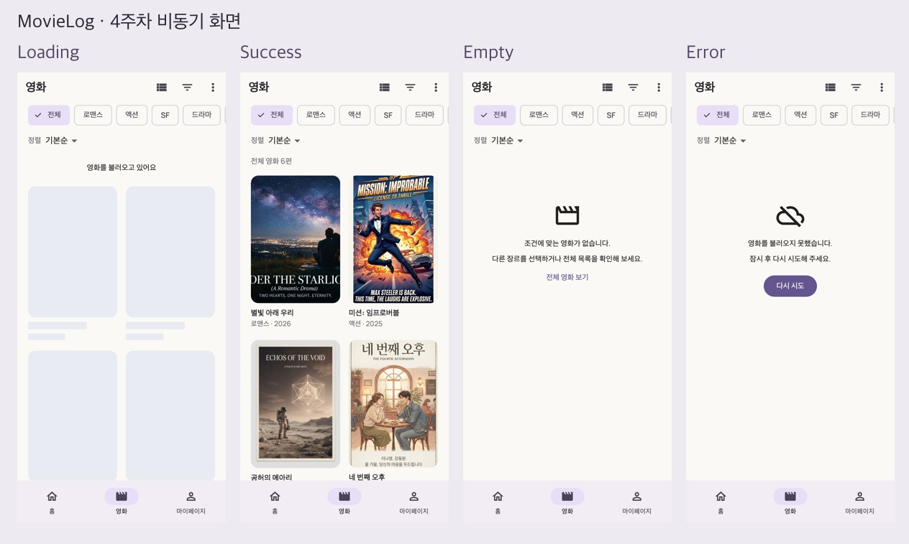

# 4주차 프론트엔드 미션 — 비동기 영화 목록과 로컬 저장

- 이름 / 닉네임: 케빈
- [GitHub 실습 저장소](https://github.com/brownglasses/11th_PE_Mobile_Flutter_Practice_Mission/tree/codex/week04-async-storage)
- Pull Request: [실습 PR #5](https://github.com/UMC-Inha/11th_PE_Mobile_Flutter_Practice_Mission/pull/5)
- [원본 워크북](https://makeus-challenge.notion.site/4-1-3f2b57f4596b80e2be8cf771264922d0)
- [핵심 개념 정리](../../../keyword/Frontend/chapter04/keyword.md)

## 구현 결과

3주차의 영화 모델·Mock Data·카드·Route·하단 탭을 유지하고 MovieGrid를 공통 Widget으로 추출했다. FakeMovieService가 1초 후 목록 또는 오류를 반환하고 FutureBuilder가 Loading·Empty·Error·Success를 각각 그린다. 재시도에서는 새 Future로 Loading을 거쳐 성공한다.



| 상태 | 인증 |
| --- | --- |
| Loading | [Skeleton 화면](images/01_loading.png), 800ms 이후에도 Loading인 테스트 통과 |
| Success | [영화 목록](images/02_success.png) |
| Empty | [빈 목록 안내](images/03_empty.png), 전체 보기·새로고침 제공 |
| Error | [오류 안내](images/04_error.png), 내부 예외 없이 다시 시도 제공 |
| 재시도 | [실제 브라우저 전환 영상](videos/week04-retry.mp4) |
| 재실행·복원 | [실제 브라우저 복원 영상](videos/week04-restore.mp4), [저장 직후](images/08_browser_saved_genre.jpg), [새 실행 후](images/09_browser_restored_genre.jpg) |

상태 PNG는 실제 Flutter Widget을 테스트 환경에서 렌더링했다. 영상은 실제 Chrome 앱에서 관찰한 화면 캡처를 연결했으며 긴 관찰 대기만 줄였다. 복원은 SharedPreferencesAsync의 실제 웹 저장소를 사용하고 Query 없는 `/movies` 새 문서 실행에서 SF가 선택되는 것을 확인했다. OS 프로세스 종료 또는 iOS/Android 실기기 재실행 녹화는 아니다. 테스트 환경의 Memory Preferences 검증과 실제 웹 저장 검증을 구분했다.

## 필수·심화 체크리스트

- [x] Movie·MovieCard·기존 영화 Route 재사용, 기존 Grid를 MovieGrid로 분리
- [x] `Future<List<Movie>>`, 기본1초 지연(최소800ms Loading)
- [x] 최초 Future는 `MovieListScreen.initState → _loadInitialData`
- [x] Loading·Empty·Error Widget 분리, Success는 MovieGrid/ListTile
- [x] 오류 다시 시도와 새 Future 할당, 내부 Exception·StackTrace 화면 미노출
- [x] Chip 선택 즉시 로컬 필터링, SharedPreferencesAsync 저장·복원
- [x] 직접 await 후 setState/context 사용 전 mounted 확인
- [x] API 교체 경계에 `TODO(5주차 유저별 평점 조회 API)`
- [x] 실제 API·Dio·Retrofit·Provider·MVVM 미사용
- [x] RefreshIndicator와 AlwaysScrollableScrollPhysics
- [x] 2초 Future.timeout 및 안내·재시도
- [x] 영화 카드 형태 Skeleton
- [x] 기본순·제목순·평점순 저장
- [x] 서비스 성공·빈 목록·실패 Unit Test 및 네 상태 Widget Test
- [x] flutter analyze: No issues found, flutter test: 17개 통과, Web build 성공

## 핵심 코드와 저장 키

[FakeMovieService](https://github.com/brownglasses/11th_PE_Mobile_Flutter_Practice_Mission/blob/codex/week04-async-storage/movielog/lib/core/services/fake_movie_service.dart), [GenrePreference](https://github.com/brownglasses/11th_PE_Mobile_Flutter_Practice_Mission/blob/codex/week04-async-storage/movielog/lib/core/storage/genre_preference.dart), [MovieListScreen](https://github.com/brownglasses/11th_PE_Mobile_Flutter_Practice_Mission/blob/codex/week04-async-storage/movielog/lib/features/movies/presentation/movie_list_screen.dart), [상태 Widget](https://github.com/brownglasses/11th_PE_Mobile_Flutter_Practice_Mission/blob/codex/week04-async-storage/movielog/lib/features/movies/presentation/widgets/movie_list_states.dart), [테스트](https://github.com/brownglasses/11th_PE_Mobile_Flutter_Practice_Mission/blob/codex/week04-async-storage/movielog/test/async_movie_test.dart).

`selected_genre`: String, 단일 SF 또는 기존 다중 선택은 쉼표 구분, 전체는 빈 문자열. `movie_sort`: String, original/title/rating. 유효하지 않은 장르를 제거하고 알 수 없는 정렬은 기본순으로 복원한다. 명시적 `?genres=SF` 딥링크는 저장 장르보다 우선한다. 민감한 값은 저장하지 않는다.

```dart
// 최초 요청: build 밖에서 보관
void initState() {
  super.initState();
  _genres = Set.of(widget.selectedGenres);
  _preferences = widget.preferences ?? GenrePreference();
  _moviesFuture = _loadInitialData(widget.initialMode);
}
// 재시도·새로고침: 같은 완료 Future를 재사용하지 않는다.
setState(() { _moviesFuture = future; });
```

## 진행 과정과 검증

1. 기존 영화 목록의 모델과 카드·탭을 확인하고, Service와 Preferences를 교체 가능한 호출 경계로 분리했다.
2. FakeMovieService에 success/empty/failure/timeout 모드를 넣고 초기 목록·설정을 Future.wait로 읽었다.
3. waiting → hasError → 빈 결과 → 성공 순으로 Widget을 연결했다. 필터 변경은 받은 목록만 갱신해 Future를 다시 만들지 않는다.
4. 저장 큐로 빠른 연속 선택의 순서를 보장하고 장르 저장 완료 후 Query를 바꿨다. 사용자 조작이 초기 복원값에 덮이지 않도록 변경 여부를 보관했다.
5. 서비스·화면·재시도·타임아웃·새로고침·dispose 테스트를 수행했다. 실제390×844 Chrome 앱에서도 SF 저장과 Query 없는 새 문서의 복원을 확인했다.
6. 기존 화면을 대상으로 [Lazyweb 디자인 근거 보고서](https://www.lazyweb.com/report/lazyweb/5d83c0ea-50eb-4310-aa27-fdc91bcbe7e0/?source=create)를 생성했다. Atlys의 오류·Retry와 Freevee의 빈 목록 안내를 참고해 실패의 행동과 Empty의 설명을 분리했다. 워크북의 기존 모습을 유지하는 범위에서 적용했으며 제안된 큰 변형 헤더는 추가하지 않았다.

검증 명령은 `flutter analyze`, `flutter test`, `flutter build web --debug --dart-define=INITIAL_LOCATION=/movies`이며 모두 성공했다.

## 트러블슈팅

### No.1 setState Callback이 Future를 반환함

- 재현: Error에서 다시 시도, mode=failure 이후 success.
- 기대: 새 Future 할당 후 Loading.
- 실제: `setState(() => _moviesFuture = future)`가 대입 결과인 Future를 반환해 Flutter의 setState 규칙 위반.
- 수정: 중괄호 Callback으로 반환값 없이 할당했다. 재시도 성공·타임아웃 재시도 테스트와 실제 브라우저 영상으로 확인했다.
- Future 위치: initState와 `_reload`, setState: `_reload`의 동기 할당. await 이후 초기 결과는 mounted 확인 후 반영한다.

### No.2 장르 저장 직후 새로고침하면 선택이 사라짐

- 재현: Success에서 SF Chip을 누른 직후 Query 없는 새 문서 실행.
- 기대: SF 복원. 실제: 처음 확인에서 전체 목록으로 돌아왔다.
- 원인: 설정 쓰기를 기다리지 않고 URL 갱신·재실행이 먼저 진행됐다.
- 수정: `_persist`가 저장 큐 Future를 반환하고 `_selectGenres`에서 await한다. 연속 클릭의 이전 완료가 최신 Query를 덮지 않게 selectionVersion도 검사한다.
- Key: selected_genre / movie_sort. await 뒤 mounted를 확인한다.
- 확인: 실제 웹 저장 완료 후 `/movies?genres=SF`, 새 Query 없는 `/movies`에서 SF · 1편 확인. 이미지와 영상 첨부.

### No.3 테스트 종료 후 남은 지연 Timer

- 재현: 다른 탭에서 영화 탭으로 이동한 직후 기존 테스트가 종료됨.
- 원인: 새로 추가한1초 Service Future를 테스트가 기다리지 않았다.
- 수정: 목록 진입 후 지연을 진행시켜 화면 완료를 확인하고, dispose 테스트에서도 남은 Future를 진행시켜 setState 오류가 없는지 확인했다.

## 4주차 회고

비동기 데이터는 성공 목록 하나가 아니라 대기·빈 결과·오류까지 포함해 화면의 계약이 된다는 점을 구현으로 확인했다. 필터 선택과 데이터 재요청을 분리해야 불필요한 Loading이 반복되지 않았다. 특히 저장 버튼을 눌렀다는 사실과 저장이 완료됐다는 사실을 구분하지 않으면 재실행 복원이 흔들렸고, await·저장 순서·mounted를 함께 점검해야 했다. 다음 주에는 MovieService 경계를 실제 API로 교체하되 이 상태 흐름과 테스트는 유지할 수 있다.
